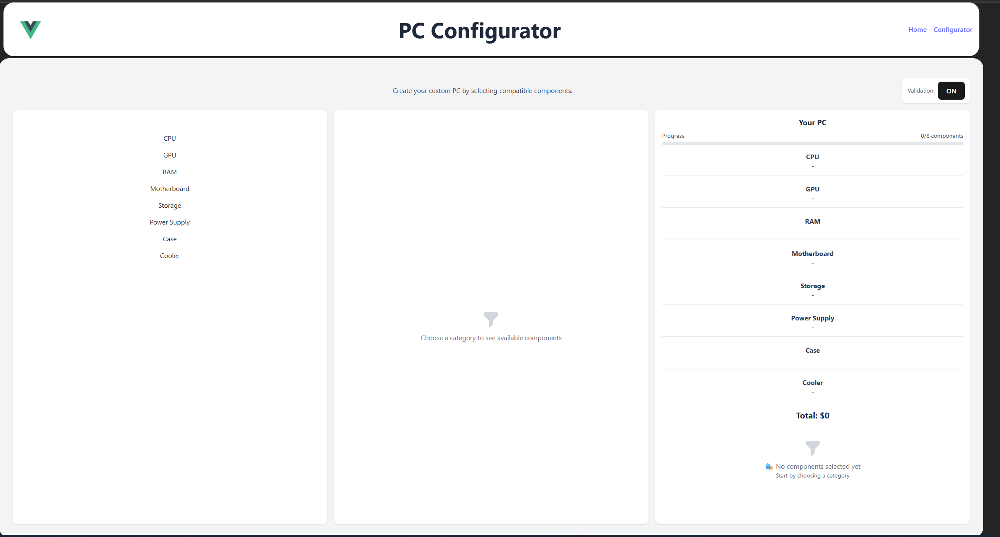
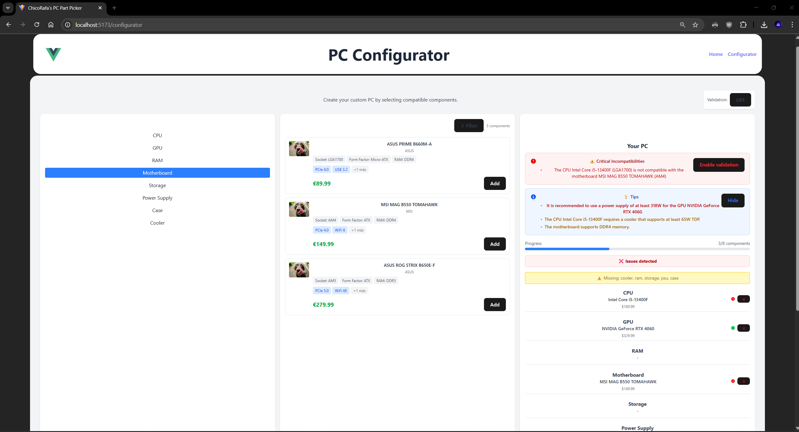
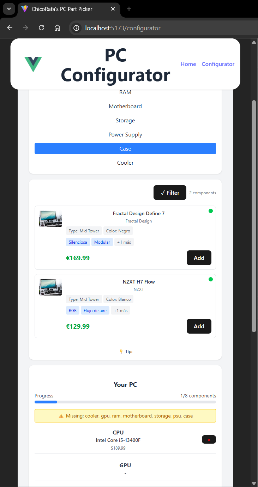

# 🖥️ PC Configurator

A complete and intuitive PC configurator built with **Vue 3**, **Tailwind CSS**, and **Pinia**, featuring an advanced compatibility validation system for components.

## ✨ Main Features

### 🧩 **Modular Configuration**
- **8 component categories**: CPU, GPU, RAM, Motherboard, Storage, PSU, Case, Cooler
- **3-column interface**: Categories → Selector → PC Builder
- **Responsive design** optimized for desktop and mobile

### 🔧 **Smart Compatibility System**
- **Automatic validation** of component compatibility
- **Intelligent filtering** to show only compatible components
- **Visual alerts** with color codes (🟢 Compatible, 🟡 Warning, 🔴 Incompatible)
- **Specific validations**:
  - CPU ↔ Motherboard (Socket)
  - RAM ↔ Motherboard (DDR4/DDR5)
  - GPU ↔ PSU (Power consumption)
  - CPU ↔ Cooler (Socket & TDP)
  - Motherboard ↔ Case (Form factor)

### 📊 **Detailed Information**
- **Performance estimation** (Gaming 1080p/1440p, Productivity)
- **Power consumption calculation** and PSU recommendations
- **Real-time total price** with component breakdown
- **Automatic recommendations** based on current selection

### 💾 **Data Persistence**
- **Automatic saving** in localStorage
- **Export configurations** as JSON
- **Simulated purchase history**
- **REST API** with json-server and Docker

## 🛠️ Tech Stack

- **Frontend**: Vue 3 (Composition API), Tailwind CSS, Pinia
- **Backend**: Express.js, json-server, Docker
- **Database**: JSON with mock data
- **Build**: Vite
- **State**: Pinia (Vuex successor)

## 🚀 Installation & Usage

### Prerequisites
- Node.js 24+
- Docker (optional, for the API)

### 1. Clone the repository
```bash
git clone https://github.com/your-username/pc-configurator.git
cd pc-configurator
```

### 2. Install dependencies
```bash
npm install
```

### 3. Start the API (Docker)
```bash
docker-compose up -d
```

### 4. Run the application
```bash
npm run dev
```

The app will be available at `http://localhost:5173`

## 📁 Project Structure

```
src/
├── components/          # Reusable Vue components
│   ├── ComponentCard.vue        # Individual component card
│   ├── ComponentCategory.vue    # Category list
│   ├── ComponentSelector.vue    # Component selector
│   ├── PCBuilder.vue           # PC builder view
│   ├── CompatibilityAlerts.vue # Compatibility alerts
│   └── PurchaseComponent.vue   # Purchase modal
├── services/            # App services
│   ├── api.js          # REST API client
│   └── compatibilityService.js # Validation logic
├── store/              # Global state (Pinia)
│   └── pcConfig.js     # Main store
├── views/              # Main views
│   └── Configurator.vue
└── App.vue             # Root component
```

## 🎯 Detailed Features

### Compatibility System
The configurator includes smart validations to prevent invalid builds:

```javascript
// Example: CPU-Motherboard validation
validateCpuMotherboard(cpu, motherboard) {
  const compatible = cpu.socket === motherboard.socket
  const warnings = compatible ? [] : [
    `CPU ${cpu.name} (${cpu.socket}) incompatible with ${motherboard.name} (${motherboard.socket})`
  ]
  return { compatible, warnings }
}
```

### State Management
Pinia is used for reactive, well-structured state:

```javascript
// Main store
const pcStore = usePcConfigStore()

// Add component with validation
pcStore.addComponent('cpu', selectedCPU)

// Validate full configuration
const validation = pcStore.validateCurrentConfiguration()
```

### API & Data
Components are loaded from a REST API with local fallback:

```javascript
// Auto-load on app start
await pcStore.loadFullConfiguration()
```

## 🔧 API Endpoints

The app consumes these endpoints:

- `GET /api/categories` - List of categories
- `GET /api/components/:category` - Components by category
- `GET /api/components/:category/:id` - Specific component

## 📱 Responsive Design

### Desktop (1024px+)
- 3-column layout with full info
- Performance estimation panels
- Expanded compatibility alerts

### Tablet (768px - 1023px)
- Adaptive layout with stackable columns
- Tab-optimized navigation

### Mobile (< 768px)
- Vertical layout with smooth scrolling
- Touch-optimized interface
- Collapsible panels

## 🎨 UX/UI Features

- **Visual indicators** for compatibility status
- **Smooth animations** for transitions
- **Instant feedback** when selecting components
- **Smart confirmations** for critical actions
- **Informative tooltips** with technical specs

## 🧪 Use Cases

### Novice User
- Validation enabled by default
- Sees only compatible components
- Guides and automatic recommendations

### Expert User
- Can disable validations
- Access to all components
- Force builds with confirmation

### Commercial Use
- Export configurations
- Build history
- Updated price estimates

## 🔮 Roadmap / Future Improvements

- [ ] **Integration with real manufacturer APIs**
- [ ] **Real-time price comparison**
- [ ] **Review and rating system**
- [ ] **Recommended builds by budget**
- [ ] **Advanced bottleneck calculator**
- [ ] **Online store integration**
- [ ] **User system** and saved builds
- [ ] **Full offline mode**

## 🤝 Contribute

1. Fork the project
2. Create a branch for your feature (`git checkout -b feature/new-functionality`)
3. Commit your changes (`git commit -m 'Add new functionality'`)
4. Push to the branch (`git push origin feature/new-functionality`)
5. Open a Pull Request

## 📄 License

This project is licensed under the MIT License. See the [LICENSE](LICENSE) file in the root of the project for more details.

## 👨‍💻 Author

**ChicoRafa** - [GitHub](https://github.com/ChicoRafa) - [LinkedIn](https://linkedin.com/in/rafael-rmr01)

---

### Screenshots

#### Main View


#### Compatibility System


#### Mobile View


---

⭐ **If you like this project, give it a star!** ⭐